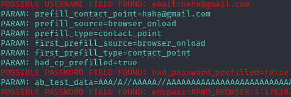

## Credential Harvesting with Site Cloning

Steps:
1. Open ``` setoolkit ``` and insert your Kali Linux password
2. Select ``` Social-Engineering Attacks ``` -> ``` Web Site Attack Vectors ``` -> ```Credential Harvester Attack Method ``` --> ``` Site Cloner ```
3.Set IP address for the fake site
4. URL to clone: https://www.facebook.com/login.php

### Results


